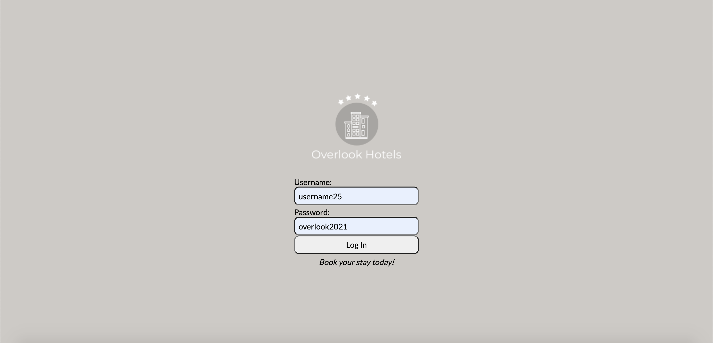
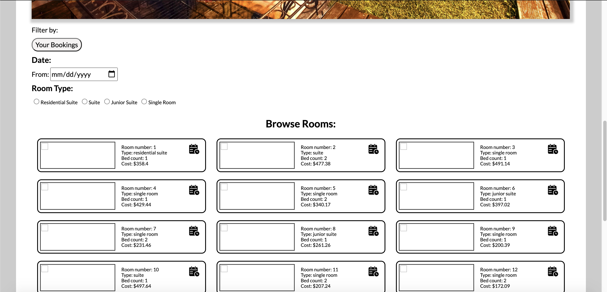
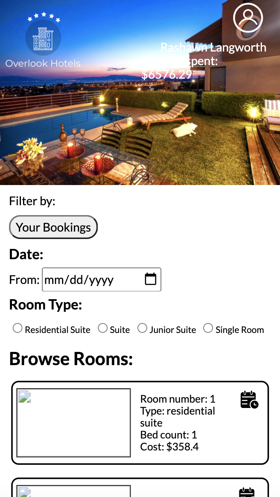
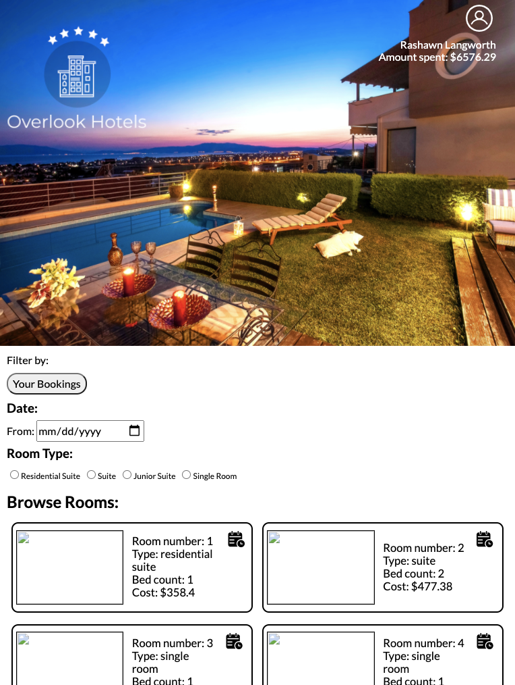

# Overlook

## Introduction
__Overlook Hotels__ is your go-to resort destination! With this new booking app, booking your next vacation with be a _breeze_.

##How to use:
+ Users are first greeted with a login page where they can enter their unique credentials to access their account information.

+ Upon entering the site's dashboard, users will see their name and running total of the amount they've spent on bookings.

+ Users can not only search for their ideal room by type or the date of their planned visit, but they can also see rooms they've held in the past so
they know exactly which one is right for them.

This app is responsive, suitable for desktop, laptop, tablet, or mobile devices.

## Wireframe and Class Structure
https://miro.com/app/board/o9J_lRWNG-M=/

## Goals
+ Designing a clean, responsive layout
+ Reaching peak accessibility
+ Strengthening familiarity with fetch API

## Technologies
+ HTML
+ CSS
+ JavaScript

## Challenges and Triumphs
*Challenges:*
+ Retrieving and reusing data

## Local install instructions
+ `git clone` Overlookrepository (front-end)
+ `git clone` [overlook-api repository](https://github.com/turingschool-examples/overlook-api) (back-end API)
+ Run `npm start` in both repositories
+ Visit "http://localhost:8080/" in a browser of your choice

## Contributors
+ Reggie Thompson, https://github.com/rdtho2525

### _Book your stay today!_
